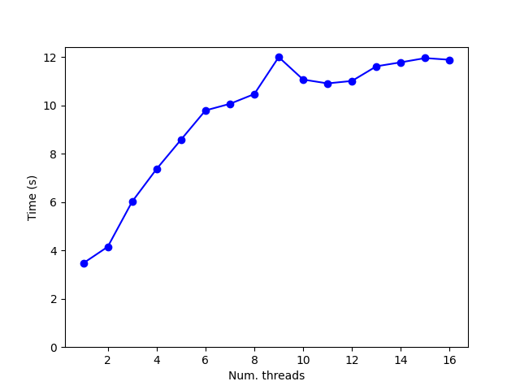
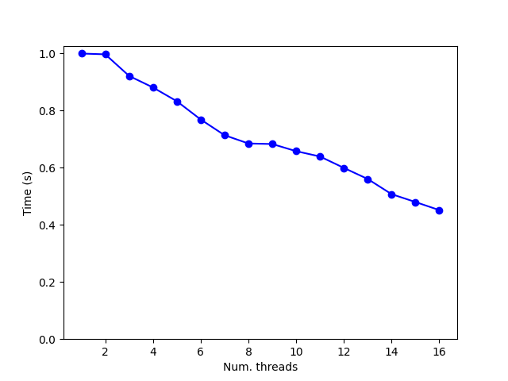

# Threaded Map-Reduce for Free-Threaded Python

## Why This Exists

I do a lot of work in bioinformatics, especially in genetics, and the [free-threaded Python](https://docs.python.org/3/howto/free-threading-python.html) seems very promising for my CPU bound tasks.
Also, I am used to implement many of my computing tasks using the [map reduce](https://en.wikipedia.org/wiki/MapReduce) approach.
So I decided to try to implement a threaded map reduce and I wanted to use [iterables](https://docs.python.org/3/glossary.html#term-iterable) for as the input.

So, the objective is to implement a function with an interface similar to:

```python
def map_reduce(
    map_fn,
    reduce_fn,
    iterable: Iterable,
    num_threads: int,
)
```

Of course, all this makes sense when the experimental free-threaded Python is used. If you use the standard Python adding extra threads to a CPU bound task is, at best, useless.
I have used the Python 3.13.5t provided by uv.

## Usage

### Basic Example

```python
from threaded_map_reduce import map_reduce
from operator import add

# Count squares of numbers 1-1000 using 4 threads
def square(x):
    return x * x

result = map_reduce(
    map_fn=square,
    reduce_fn=add,
    iterable=range(1, 1001),
    num_computing_threads=4,
    num_items_per_chunk=100
)
print(f"Sum of squares: {result}")
```

### Prime Counting Example

```python
def is_prime(n):
    if n < 2:
        return False
    if n == 2:
        return True
    if n % 2 == 0:
        return False
    for i in range(3, int(n**0.5) + 1, 2):
        if n % i == 0:
            return False
    return True

# Count primes in range 1-100000 using 8 threads
prime_count = map_reduce(
    map_fn=lambda x: 1 if is_prime(x) else 0,
    reduce_fn=add,
    iterable=range(1, 100001),
    num_computing_threads=8,
    num_items_per_chunk=1000
)
print(f"Number of primes: {prime_count}")
```

## Threaded architecture

### API Reference

```python
def map_reduce(
    map_fn: Callable[[T], U],
    reduce_fn: Callable[[U, U], U], 
    iterable: Iterable[T],
    num_computing_threads: int,
    num_items_per_chunk: int
) -> U
```

**Parameters:**
- `map_fn`: Function to apply to each item in the iterable
- `reduce_fn`: Binary function to combine results (must be associative)
- `iterable`: Input data to process
- `num_computing_threads`: Number of worker threads to spawn
- `num_items_per_chunk`: Number of items to batch together for processing

**Returns:** The final reduced result

**Important Notes:**
- `reduce_fn` must be associative (order of operations shouldn't matter)
- Larger `num_items_per_chunk` reduces queue overhead but may affect load balancing
- Requires free-threaded Python (3.13t+) for true parallel execution

### Computing Architecture

This is the computing architecture.

```mermaid
flowchart TD
        A(["Items to process"])
        I@{ shape: das, label: "Items queue"}
        T@{ shape: rect, label: "Computing thread 1"}
        U@{ shape: rect, label: "Computing thread 2"}
        R1("Reduced result 1")
        R2("Reduced result 2")
        R@{ shape: das, label: "Results queue"}
        Z@{ shape: rect, label: "Final reduce"}
        A  --> I
        I --> T
        I --> U
        T --> R1
        U --> R2
        R1 --> R
        R2 --> R
        R --> Z
```

- The main thread creates two queues, one to send the items to the processing threads and another to gather the map-reduced result of every processing thread.
- The main thread also launches the processing threads, one per thread asked by the user. These are the threads that will carry out most of the computation
- There's an aditional thread that feeds the items to the items queue, and the processing threads take the items to compute from that queue
- After the computation is done, the final result calculated by every processing thread is send to the results queue.
- Finally, the main thread reduces all the results found in the results queue.

It seems to me that the architecture might be overly complex, but this is my first time writting a threaded application and, after a good number of attemps, this is what I have managed to get working.

## Prime performance

To check the performance I have taken from stack overflow a prime checker, a function that checks if a number is prime, and the task is to count the number of primes in a range of integers.

The first result was not good.



The more threads used, the more time it took to count the number of primes.

After a while I thought that the problem might have been to much traffic in the items queue, so I tried to group the items into chunks and to send these chunks instead of the items through the pipe. Each chunk included 100 items and the result was better now.


Still the result is better, but not great, when more than 10 threads are used the performance is damaged. So I tried with even bigger chunks, 10000 items per chunk, and the performance improved.


Still the result is not ideal. The efficiency is not perfect. Ideally adding a processor to the task should reduce the time according to the computing power of that processor. The ideal efficiency is one, but this is not the case, adding threads improves the result, but the effiency decreases with the number of threads.



## Troubleshooting

### Common Issues

**Q: Performance is worse with more threads**
- A: This usually indicates chunk size is too small. Try increasing `num_items_per_chunk` to 1000-10000.

**Q: Getting `TypeError: reduce() of empty iterable`**
- A: Ensure your iterable is not empty and your `reduce_fn` can handle the data types from `map_fn`.

**Q: No performance improvement on standard Python**
- A: This is expected due to the GIL.


## Contributions Welcome

I'd like to improve the implementation and performance, so any suggestions, bug reports, or pull requests are welcomed! Please feel free to:

1. Open an issue for bugs or feature requests
2. Submit pull requests with improvements
3. Share your benchmarking results
4. Suggest optimizations or alternative approaches

